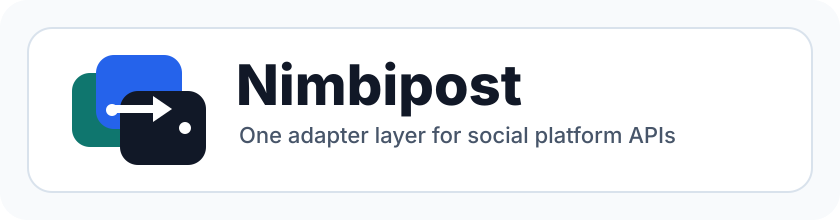

<p align="center">
  
</p>

# Nimbipost

Nimbipost is a TypeScript SDK for working with social platforms through a shared adapter interface. It keeps platform-specific authentication, request signing, pagination, and API details inside each adapter so callers can use common user, post, and search methods across services.

Current focus:

- X/Twitter: session handling, login flow, GraphQL requests, pagination, model normalization, and `X-Client-Transaction-Id` injection.
- Multi-platform adapters: Bluesky, Mastodon, Reddit, YouTube, TikTok, Telegram, Threads, and Instagram.
- Extension-ready architecture: add a new platform by implementing `PlatformAdapter` and registering it in `createPlatformAdapter`.

## Quick Start

```ts
import { createPlatformAdapter } from 'nimbipost';

const x = createPlatformAdapter('x');

const userId = await x.getUserId('elonmusk');
const me = await x.getMe?.();
const user = await x.getUserData('elonmusk');
const posts = await x.getUserPosts(userId, { total: 100 });
const post = await x.getPost('1234567890');
const search = await x.search('from:elonmusk', { searchFilter: 'Latest' });
```

Authenticated X/Twitter reads can pass an `authToken`. The adapter will bootstrap
the matching `ct0` CSRF cookie/header from X before calling authenticated GraphQL
endpoints.

```ts
const x = createPlatformAdapter('x', {
  authToken: process.env.X_AUTH_TOKEN,
});

const userId = await x.getUserId('barton6026');
const following = await x.getFriends?.(userId, {
  following: true,
  total: 20,
});
const followers = await x.getFriends?.(userId, {
  follower: true,
  total: 20,
});
```

X/Twitter also keeps legacy aliases for compatibility:

- `getUserTweets` -> `getUserPosts`
- `getTweet` -> `getPost`
- `getLikedTweets` -> `getLikedPosts`
- `getTweetLikes` -> `getPostLikes`
- `getRetweeters` -> `getReposters`

## Supported Platforms

| Platform | Factory name | Adapter scope | Common credentials |
| --- | --- | --- | --- |
| X/Twitter | `x` | Primary GraphQL adapter | guest session, account login, saved session |
| Bluesky | `bluesky` | AT Protocol public API adapter | optional access token |
| Mastodon | `mastodon` | Instance-scoped REST API adapter | instance URL, optional access token |
| Reddit | `reddit` | OAuth API adapter | access token |
| YouTube | `youtube` | YouTube Data API adapter | API key or access token |
| TikTok | `tiktok` | Display API adapter | access token |
| Telegram | `telegram` | Bot API adapter | bot token |
| Threads | `threads` | Threads Graph API adapter | access token, user id |
| Instagram | `instagram` | Instagram Graph API adapter | access token, user id |

Non-X adapters are lightweight read adapters shaped around the official platform APIs. Live usage depends on each platform's permissions, app review status, token scopes, rate limits, and API availability.

## Adapter Interface

The shared interface lives in `src/core/platform-adapter.ts`.

Core methods:

```ts
interface PlatformAdapter {
  readonly platform: PlatformName;

  init(): Promise<void>;
  getUserId(username: string | number): Promise<string>;
  getUserData(username: string): Promise<unknown>;
  getUserInfo(userId: string | number): Promise<unknown>;
  getUserPosts(
    userId: string | number,
    options?: PaginationOptions,
  ): Promise<PaginatedResult>;
  getPost(
    postId: string | number,
    options?: PaginationOptions,
  ): Promise<unknown>;
  search(
    query: string,
    options?: PaginationOptions,
  ): Promise<PaginatedResult>;
}
```

Optional capabilities:

- Session lifecycle: `generateSession`, `login`, `loggedIn`, `saveSession`, `loadSession`.
- API refresh: `updateApi`.
- Batch users: `getMultipleUsersData`.
- Platform-specific reads: media, likes, reposts, friends, lists, topics, and highlights.

## Adapter Examples

```ts
const bluesky = createPlatformAdapter('bluesky', {
  serviceUrl: 'https://public.api.bsky.app',
});

const mastodon = createPlatformAdapter('mastodon', {
  instanceUrl: 'https://mastodon.social',
  accessToken: process.env.MASTODON_ACCESS_TOKEN,
});

const reddit = createPlatformAdapter('reddit', {
  accessToken: process.env.REDDIT_ACCESS_TOKEN,
});

const youtube = createPlatformAdapter('youtube', {
  apiKey: process.env.YOUTUBE_API_KEY,
});

const tiktok = createPlatformAdapter('tiktok', {
  accessToken: process.env.TIKTOK_ACCESS_TOKEN,
});

const telegram = createPlatformAdapter('telegram', {
  botToken: process.env.TELEGRAM_BOT_TOKEN,
});

const threads = createPlatformAdapter('threads', {
  accessToken: process.env.THREADS_ACCESS_TOKEN,
  userId: 'me',
});

const instagram = createPlatformAdapter('instagram', {
  accessToken: process.env.INSTAGRAM_ACCESS_TOKEN,
  userId: 'me',
});
```

## HTTP Gateway

Nimbipost can also run as a standalone Node HTTP service. This is the recommended integration path for non-Node backends such as Go services.

Install or link the SDK, then run the Gateway from the package:

```bash
npm install nimbipost
npx nimbipost-gateway
```

Build and start the gateway:

```bash
npm run build
NIMBIPOST_PORT=4334 npm run start:gateway
```

For local development, `npm run gateway` builds the package and starts the gateway in one command.

Available endpoints:

```http
GET /health
GET /v1/:platform/users/:username
GET /v1/:platform/users/:username/posts?total=20
GET /v1/:platform/posts/:postId
GET /v1/:platform/search?q=BTC
```

Example:

```bash
curl "http://localhost:4334/v1/x/users/elonmusk/posts?total=20"
```

Authenticated X/Twitter Gateway usage:

```bash
X_AUTH_TOKEN=your_auth_token NIMBIPOST_PORT=4334 npm run start:gateway
curl "http://localhost:4334/v1/x/users/barton6026"
```

Gateway responses are JSON. User and post detail endpoints return `{ platform, data }`; paginated endpoints return `{ platform, data, cursor_endpoint, has_next_page }`.

Common gateway environment variables:

| Variable | Purpose |
| --- | --- |
| `NIMBIPOST_HOST` | Bind host. Defaults to `0.0.0.0`. |
| `NIMBIPOST_PORT` or `PORT` | Bind port. Defaults to `4334`. |
| `X_AUTH_TOKEN` | Optional X/Twitter auth token. |
| `X_PUBLIC_BEARER_TOKEN` | Optional override for the X/Twitter public bearer token used by guest sessions. |
| `BLUESKY_SERVICE_URL` | Optional Bluesky service URL. |
| `BLUESKY_ACCESS_TOKEN` | Optional Bluesky access token. |
| `MASTODON_INSTANCE_URL` | Mastodon instance URL. |
| `MASTODON_ACCESS_TOKEN` | Optional Mastodon access token. |
| `REDDIT_ACCESS_TOKEN` | Reddit OAuth access token. |
| `YOUTUBE_API_KEY` | YouTube Data API key. |
| `YOUTUBE_ACCESS_TOKEN` | Optional YouTube OAuth access token. |
| `TIKTOK_ACCESS_TOKEN` | TikTok Display API access token. |
| `TELEGRAM_BOT_TOKEN` | Telegram bot token. |
| `THREADS_ACCESS_TOKEN` | Threads Graph API access token. |
| `THREADS_USER_ID` | Threads user id. Defaults to `me`. |
| `INSTAGRAM_ACCESS_TOKEN` | Instagram Graph API access token. |
| `INSTAGRAM_USER_ID` | Instagram user id. Defaults to `me`. |
| `INSTAGRAM_GRAPH_VERSION` | Optional Instagram Graph API version. |

## X/Twitter Adapter

X/Twitter code lives in `src/platforms/x`:

- `adapter.ts`: public adapter methods and legacy aliases.
- `request-client.ts`: request client with automatic `X-Client-Transaction-Id` injection.
- `session.ts`: guest session creation backed by the local transaction id generator.
- `session-store.ts`: JSON session snapshot save/load helpers.
- `login-task-handler.ts`: onboarding task login flow.
- `api-updater.ts`: X web bundle parser for GraphQL endpoint updates.
- `models.ts`: nested-key lookup plus `User` and `Tweet` data normalization.
- `endpoints.ts` and `features.ts`: X endpoint and feature constants.
- `pagination.ts`: timeline pagination helpers.

`XRequestClient` accepts any transaction generator with this shape:

```ts
generateTransactionId(method: string, path: string): string;
```

`createGuestSession()` uses `ClientTransaction` from `@hardbrick21/x-txid-generator`.

When `authToken` is supplied, the X adapter stores `auth_token`, visits the X
homepage to collect `ct0`, and adds `X-Csrf-Token` plus `X-Twitter-Auth-Type`.
This is required for authenticated endpoints such as following/follower lists.

## Status

Implemented:

- Generic `PlatformAdapter` method names decoupled from X/Twitter terminology.
- `createPlatformAdapter` support for 9 platforms.
- X/Twitter guest sessions, login flow, and session persistence.
- X/Twitter `auth_token` session bootstrap with `ct0` CSRF header support.
- Automatic `X-Client-Transaction-Id` injection for X/Twitter requests.
- X/Twitter GraphQL endpoint updater.
- X/Twitter user, post, timeline, search, like, repost, friend, list, and topic read methods.
- Standalone HTTP Gateway for SDK access from non-Node services.
- Basic read adapters and test coverage for non-X platforms.

Not yet covered:

- Live token/API-key validation for every external platform.
- Full production end-to-end login and long-running crawl verification for X/Twitter.
- Python pickle session compatibility; this Node version uses JSON session snapshots.

## Development

```bash
npm test
npm run lint
npm run build
npm run gateway
```

## GitHub Pages

The static introduction site lives in `docs/`.

To deploy it with GitHub Pages, configure the repository page source to publish from the `main` branch and the `/docs` folder. The page is plain HTML, CSS, and SVG, so it does not need a build step.

Test focus:

- `tests/generic-platform-adapter.test.ts`: generic methods and X/Twitter legacy aliases.
- `tests/gateway/server.test.ts`: HTTP gateway route mapping.
- `tests/platforms/external-adapters.test.ts`: external adapter API path mapping.
- `tests/x/*`: X/Twitter request, login, model, pagination, and session behavior.
